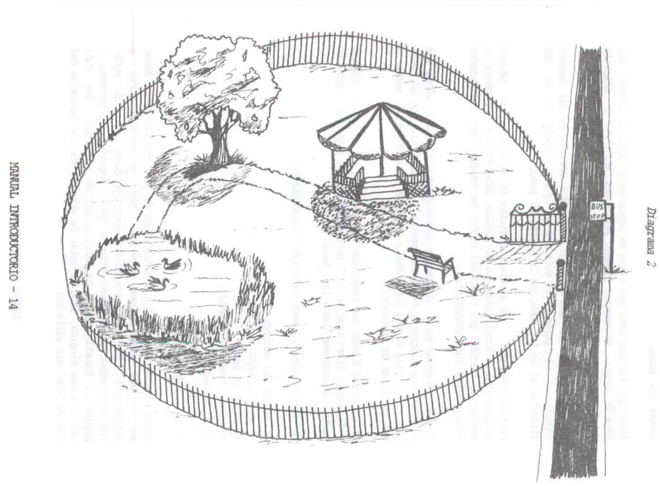
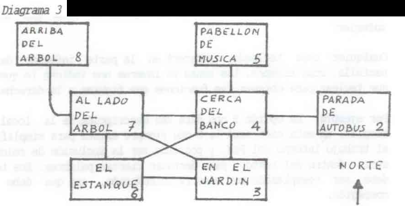
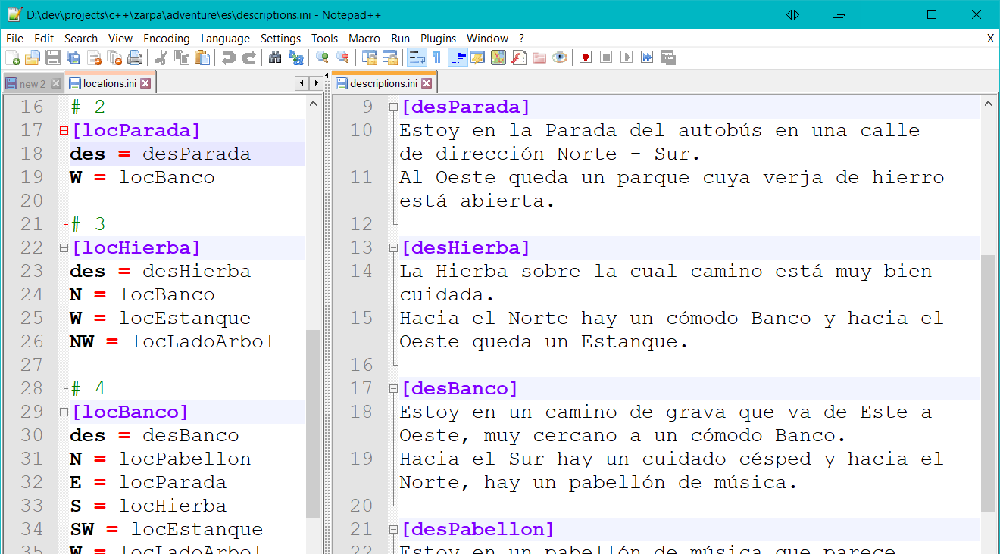
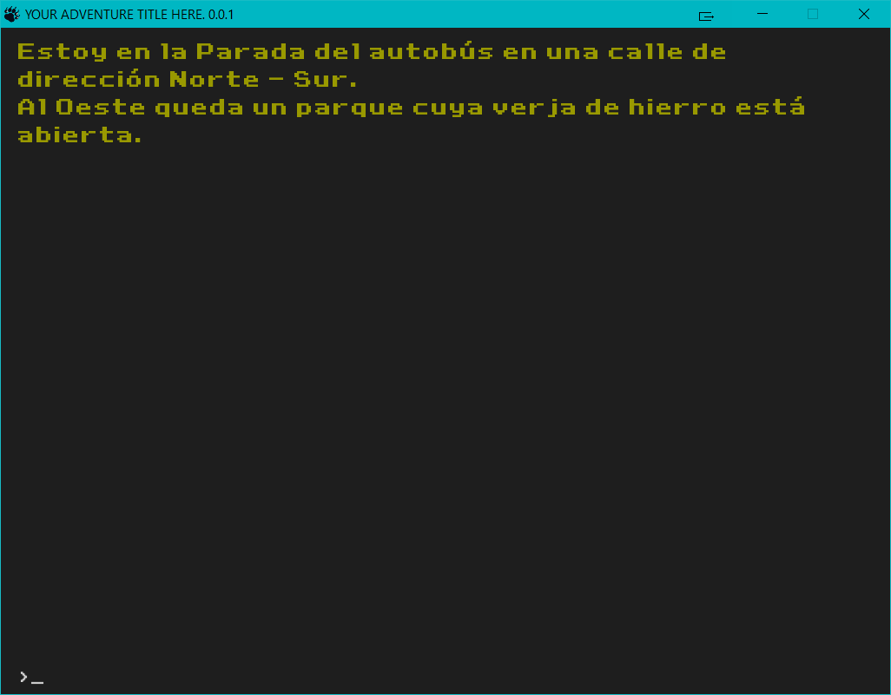
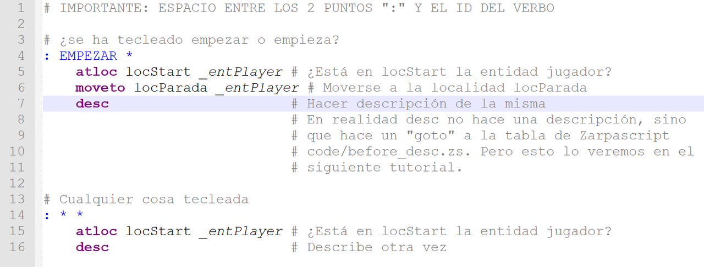

# ZARPA creador de aventuras. Tutorial Básico (1ª parte)

- [Guión Inicial](#guión-inicial)
- [Diseño del Juego](#diseño-del-juego)
- [Antes de continuar...](#antes-de-continuar...)
- [Localidades](#localidades)
- [Descripciones](#descripciones)
- [Probando la aventura](#probando-la-aventura)
- [Objetos](#objetos)
- [Mensajes](#mensajes)
- [Vocabulario: Nombres](#vocabulario:-nombres)
- [Localidad inicial](#localidad-inicial)
- [Probando la aventura otra vez](#probando-la-aventura-otra-vez)

## Guión Inicial

Este tutorial está basado en el original de **PAWS** Professional Adventure Writing System, también conocido como **PAW** (nombre que usaré yo),  que venía con la versión española para Spectrum. He intentado dejar la aventura lo más fiel posible a la original pero modificando los textos donde sea necesario para adaptarlo a los nuevos tiempos y a los cambios de programación que usa Zarpa.

En nuestro ejemplo tomaremos los problemas que pueden ocurrirle a un pasajero en su vuelta a casa:

*Mientras estaba en la Parada de autobús, el billete de subida fue arrebatado por un golpe de viento y luego cogido y llevado por un pajarito hasta un cercano parque.*

En nuestra aventura, debemos dirigir al pasajero para encontrar el billete antes de que llegue el autobús.

## Diseño del Juego

Ahora que la idea está más clara, es importante hacer un boceto del área del juego. En nuestro ejemplo sería algo parecido al siguiente diagrama:



**(Extraído del manual de PAW)**: *Se debe intentar hacer una escala consistente o lógica (a menos que el juego sea ilógico intencionadamente), evitando que con un solo paso se vaya de una localidad a otra que aparentemente queda a varios kilómetros de distancia.*

En nuestro ejemplo hemos escogido 7 localidades.

- Parada de autobús
- En el jardín
- Cerca del Banco
- En el pabellón de música
- El Estanque
- A lado del árbol
- Arriba del árbol

Primero vamos a definir las localidades y sus conexiones, usando el siguiente esquema:



## Antes de continuar...

...¡vamos a mover el esqueleto!.

**Aviso usuarios Windows**: Es bueno que tengas habilitado "ver extensiones de archivos conocidos" en el explorador de Windows para evitar confusiones al no poder ver la extensiones. Desde una ventana del explorador de archivos, seleccionar "Fichero/Opciones", pestaña "Ver" y DESmarcar "Ocultar extensiones para tipos de archivos conocidos".

**Aviso usuarios Linux**: Debéis poner el atributo de ejecutable a zarpa. "chmod +x zarpa". Al no venir en un tar o empaquetado en un paquete nativo de Linux, es necesario este paso.

Zarpa usa una serie de ficheros en formato texto plano para cada aventura, esos ficheros forma un "esqueleto" con la estructura necesaria. Más adelante los iremos viendo todos. De momento, vamos a crear dicho "esqueleto" de ficheros para ir modificándolos.

Donde está zarpa instalado, hay un fichero **ESQUELETON.7z**. Crea un directorio llamado tutorial en donde esté zarpa (por ejemplo, si Zarpa está en C:\zarpa, crea un directorio c:\zarpa\tutorial) y descomprime el contenido de **ESQUELETON.7z** en dicho directorio.

7z es una extensión de ficheros comprimidos de **licencia libre**, si tu gestor de ficheros comprimidos no puede abrirlo, puedes descargarlo en [www.7-zip.org](http://www.7-zip.org)

Por supuesto en linux también está disponible. Búscalo en tu distro.


Zarpa consulta la aventura activa (puedes tener las que quieras, cada una en un directorio) consultando el fichero **zarpa.ini**. Cambia la variable folder para que apunte al tutorial.

```ini
[adventure]
lang = es
folder = ./tutorial/
```

lang = le indica al parser que idioma se está usando tanto como entrada de usuario como de salida de texto. No lo modifiques ahora, déjalo en "es".

Bien, se habrán creado una serie de ficheros. Vamos a editar el de las localidades que será **locations.ini**. Si usas Windows recomiendo 100% que uses el editor de texto **Notepad++**. Puedes descargarlo en [www.notepad-plus-plus.org](http://notepad-plus-plus.org). Los usuarios de linux tienen muy buenas altenativas. FeatherPad y Geany están muy bien.


## Localidades

Abrimos **locations.ini** y empezamos a definir las localidades, el resultado sería éste:

```ini
# Lineas que empiezan por almohadilla son comentarios

# 2
[locParada]
des = desParada
W = locBanco

# 3
[locHierba]
des = desHierba
N = locBanco
W = locEstanque
NW = locLadoArbol

# 4
[locBanco]
des = desBanco
N = locPabellon
E = locParada
S = locHierba
SW = locEstanque
W = locLadoArbol

# 5
[locPabellon]
des = desPabellon
S = locBanco

# 6
[locEstanque]
des = desEstanque
N = locLadoArbol
E = locHierba
NE = locBanco

# 7
[locLadoArbol]
des = desLadoArbol
UP = locArribaArbol
S = locEstanque
SE = locHierba
E = locBanco

# 8
[locArribaArbol]
des = desArribaArbol
DOWN = locLadoArbol
```

Vamos a analizarlo todo por partes, el símbolo "#" indica un comentario, toda linea que empiece por él será ignorada. He puesto como comentario el mismo número de localidad que usó el tutorial de PAWS original como se puede ver en el esquema 3. Pero sólo es informativo, Zarpa no usa números.

Las secciones **[locParada]**, **[locHierba]**, etc. Son los ID (identificadores) que tendrá cada localidad. Este ID es único. Y es una novedad respecto a PAWS: Ya no hay "números mágicos" que recordar, cada localidad tiene un ID único y nos referiremos a ella con él. De hecho, cada elemento tiene su propio ID, ya sea una localidad, un objeto, un mensaje o un verbo, pero lo veremos más adelante.

"**desc =**" Se refiere al ID de descripción que tendrá la localidad, es decir el texto que tendrá al mostrarse. Recuerda que no ponemos el texto directamente, sino su IDentificador porque así facilitamos el poder usar varios idiomas..

"**image =**" Es el nombre del fichero de imagen (sin rutas, sólo el nombre) que tendrá la localidad.

"**music =**" El fichero de música (sin rutas, sólo el nombre) que escucharemos en la localidad.

"**N=**", "**S=**", etc. Indican la dirección (en inglés) y el ID de la localidad donde apuntan. Las direcciones posibles son N, NE, E, SE, S, SW, W, NW para los puntos cardinales, UP/DOWN para arriba/subir abajo/bajar. 
Estas direcciones son los IDs que están definidos por el sistema como verbos de movimiento. Zarpa, al igual que PAW trae unos pocos verbos predefinidos los cuales tienen ID en inglés para facilitar el uso de los mismos multiidioma. En breve veremos los ID de vocabulario.

## Descripciones

**(Extraído del manual de PAWS)**: *Ahora podemos empezar las descripciones de las localidades. Deben ser lo más imaginativas posibles, pero en estilo corto e interesante. Hay que procurar mantener una misma forma de verbo todo el tiempo, generalmente primera (yo) o segunda (tu) persona, o pronto el jugador tendrá una crisis de identidad. Sea cual sea la forma elegida, debe de estar de acuerdo con los Mensajes del Sistema (ver más adelante).*

Ya que tenemos definidas las localidades vamos a definir las descripciones. Editamos el fichero **es/descripciones.ini**. Fijate que está dentro de "es". Los textos siempre están dentro del identificador de idioma, para una supuesta versión inglesa, las descripciones estarían en **en/descriptions.ini**.

**IMPORTANTE: ESTE FICHERO POR SUS CARACTERÍSTICAS NO ES UN INI NORMAL Y NO ADMITE COMENTARIOS "#". Es el único que tiene esa restricción.**

**Truco Notepad++**: Si estáis usando Notepad++ podeis dividir la pantalla para crear dos vistas, en una dejáis **locations.ini** y en la otra **descriptions.ini**. De esta forma podéis consultar los ID de la descripciones y no cometer errores tipográficos. Para ello una vez abráis **descriptions.ini** click derecho en su pestaña y seleccionar "Mover a otra vista". El resultado será el siguiente:



```ini
[desParada]
Estoy en la Parada del autobús en una calle de dirección Norte - Sur. 
Al Oeste queda un parque cuya verja de hierro está abierta.

[desHierba]
La Hierba sobre la cual camino está muy bien cuidada. 
Hacia el Norte hay un cómodo Banco y hacia el Oeste queda un Estanque.

[desBanco]
Estoy en un camino de grava que va de Este a Oeste, muy cercano a un cómodo Banco. 
Hacia el Sur hay un cuidado césped y hacia el Norte, hay un pabellón de música.

[desPabellon]
Estoy en un pabellón de música que parece estar hecho de adornado hierro forjado pintado de blanco. 
Al Sur hay un camino de grava.

[desEstanque]
El sol crea bellos efectos de luz en la superficie del Estanque, mecida por una suave brisa. 
Hay un camino al Norte que termina en un lloroso sauce. 
Al Este queda un cuidado césped.

[desLadoArbol]
Estoy al lado de un sauce llorón. Al Sur queda el Estanque.

[desArribaArbol]
Estoy sentado en una rama en una rama del sauce, con una visión panorámica del parque.
Lejos al Este, más allá de la verja del parque, puedo ver la Parada del autobús.
```

Fácil, ¿no?. En la sección "[]" se indica el ID de la descripción, que debe coincidir con el valor "desc=" de **locations.ini** y el resto de texto hasta la siguiente "[]" o final del fichero es la descripción de la localidad.

## Probando la aventura

Como Zarpa incorpora una serie de instrucciones básica en Zarpascript por defecto en la tabla **system/code/after_prompt.zs** (las cuales puedes modificar a tu gusto), podemos lanzar el juego y movernos por él mediante los comandos n, o, se, etc. También podemos mirar el inventario (i, inv, inventario) aunque no tenemos ningún objeto todavía. O usar "sal" o "salidas" para ver las salidas disponibles.

NO DEIS AÚN DOBLE CLICK A zarpa.exe (o zarpa si estáis en linux).

Como estamos en fase de creación de la aventura, necesitamos ver los posibles mensajes de error y como Zarpa los muestra por "la salida de error estándar" que decimos en programación es necesario abrir una consola DOS si estais en Windows o una terminal Bash si estais en Linux para verlos. Tranquilos, no vamos a tener que poner complicados comandos.

**Truco Windows**: *Desde vuestro explorador de archivos, si estais en el directorio de zarpa, tecleas en donde se muestra la ruta "cmd" (siempre sin las comillas) y os abrirá la consola ya en el lugar*.

Una vez que estais en la consola, teclear "zarpa". Si habéis hecho todo como he indicado sólo os saldrá un mensaje de error fatal diciendo que la entidad del jugador no tiene su localidad inicial, algo parecido a:

- *FATAL ERROR: In entity ID '_entPlayer', location ID 'locStart' doesn't exits.*

Bueno, eso es que Zarpa necesita una localidad para la entidad jugador (_entPlayer) llamada locStart para comenzar. **Para hacerlo más bonito, deberíamos crear una localidad locStart con una breve introducción para que el jugador sepa que ha de hacer.** Lo veremos un poco más adelante.

Por ahora vamos a hacer una ñapa, algo bastante chapuza, pero sólo vamos a probar el juego. Hay que modificar de nuevo locations.ini y cambiar el ID de locParada a locStart

**locations.ini**.

```ini
# 2
[locStart]
des = desParada
W = locBanco

# (...)

# ¡¡Acordáos de cambiar el ID dirección Este del banco!!
# 4
[locBanco]
des = desBanco
N = locPabellon
E = locStart
S = locHierba
SW = locEstanque
W = locLadoArbol

```

Volvemos a teclear zarpa (o pulsamos flecha arriba y nos repite el último comando) y si todo ha ido bien no saldrá ningún mensaje y se lanzará la interface gráfica (GUI).



Vale, es bastante fea, de hecho es horrososa. Pero la GUI es muy personalizable y podemos crear temas a nuestro gusto. De momento usaremos el tema por defecto. En otro tutorial hablaré de cómo crearlos.

Podremos movernos por el mapa y ver las salidas disponibles. No está mal para unas pocas lineas de texto.

**Puedes cambiar la resolución de la ventana en la sección [gui] de zarpa.ini. No va del todo fino aún el escalado de las fuentes, así que quizás sean un poco grandes, pero es jugable.**


## Objetos

El mundo es muy aburrido sin objetos con los que interactuar, todo buen aventurero necesita algún objeto. De hecho, es bueno dejar algún que otro objeto "inútil" o que no sirva para avanzar en la aventura pero que da más realismo o vida a la misma.

En nuestra aventura, tendremos los siguientes objetos:

- Una linterna encendida.
- Una linterna apagada.
- Un sandwich.
- Una manzana.
- Un billete de autobús.
- Una piedra.
- Un anorak.

Muy importante: La linterna se trata como 2 objetos separados, se cambiará de uno a otro cuando el jugador la apague o encienda.

*La linterna no aporta nada a la aventura pero la he puesto porque el manual original de PAW la incluía (bueno, incluía una antorcha, pero los tiempos cambian...) para explicar el efecto de oscuridad. Zarpa puede simula luz y oscuridad, pero nada que ver el cutre mensaje "está muy oscuro para ver". Usa una forma mucho más versátil. Lo muestro en el tutorial de conceptos avanzados.*

Los objetos tienen diversos atributos que es importante definir, vamos a crearlos

objects.ini

```ini
# Si no se especifica "location", se asume no creado
# Recuerda que noun y adjetive son IDs DE VOCABULARIO, 
# referidos a los textos reales, NO SON LOS TEXTOS EN SÍ
[objLinternaOn]
noun = LINTERNA
adjective = ENCENDIDO
exam =  msgExamLinternaOn
gender=f
carriable = 1

[objLinternaOff]
noun = LINTERNA
adjective = APAGADO
exam =  msgExamLinternaOff
gender = f
location = _locCarried
carriable = 1

[objBolsa]
noun = BOLSA
exam = msgExamBolsa
gender = f
location = locParada
container location = locBolsa
carriable = 1

[objSandwich]
noun = SANDWICH
exam = msgExamSandwich
gender = m
location = _locCarried
carriable = 1

[objManzana]
noun = MANZANA
exam = msgExamManzana
gender=f
location = _locCarried
carriable = 1

# Ponemos definite=1 al billete porque los vamos a tratar como "el billete",
# no como "un billete".
[objBillete]
noun = BILLETE
exam = msgExamBillete
gender=m
definite=1
location = locParada
carriable = 1

[objPiedra]
noun = PIEDRA
exam = msgExamPiedra
gender=f
location = locHierba
carriable = 1

[objAnorak]
noun = ANORAK
exam = msgExamAnorak
gender=m
location = _locWorn
carriable = 1
wearable = 1
```

Vamos a ir viendo cada cosa poco a poco. Como en los casos anteriores, el ID único va dentro de la sección "[]".

*_No hace falta especificar todos los datos, Zarpa selecciona valores por defecto. En realidad el único dato obligatorio sería noun_*. Podemos clasificar los datos de los objetos en 3 categorías:

**Textos que lo definen:**  Recordad que no se trabaja directamente con textos, sino con IDs.

- noun = ID del nombre como entrada en vocabulary.ini dentro de [object nouns] que lo identifica.
- adjective = ID del adjetivo como entrada en vocabulary.ini dentro de [adjectives] que lo identifica. Los adjetivos evitan ambigüedades al tratar con objetos similares.
- exam = ID del mensaje como entrada en messages.ini que se muestra al examinar el objeto.

**Características sintácticas:** Útiles principalmente para mostrar el objeto con el comando inventario o cuando el sistema hace una acción con él.

- gender = Género. m = masculino, f = femenino. n = neutro (este último se usa en inglés).
- plural = Si la palabra implica plural. Por ejemplo "las gafas", no existe "la gafa" o "la gafas". Bueno este último como mote sí, pero eso es otra historia y debe ser contada en otra ocasión...
- definite = Si es un nombre definido. Es decir, a la hora de mostrarlo en el inventario usaremos el/los/la/las en vez de un/una.

**Caracteristicas físicas:**

- location = ID de la localidad inicial del objeto, si no se especifica, el objeto no está creado aún, por lo que está en una localidad especial llamada **_locVoid**. Hay una serie de ID de localidades reservadas por el sistema.

  - **_locVoid** Para objetos no creados o destruidos.
  - **_locCarried** Para objetos que lleva el jugador.
  - **_locWorn** Para objetos que lleva puestos el jugador.
  - **_locPlayer** Apunta siempre a la localidad actual del jugador. No puedes definir _locPlayer como localidad actual.

- carriable = Llevable, que se puede llevar. Un objeto grande como un baúl no sería llevable.
- wearable = Ponible, que puede ponerse como unos pantalones. Un objeto puede ser contenedor, llevable y ponible a la vez, por ejemplo el bolsillo de un pantalón.
- weight = Peso del objeto, no lo vamos a ver en este tutorial.
- container location = ID de la localidad que se usará como contenedor para ese objeto. No hace falta definir estas localidades en **locations.ini** ya que no se va a usar ni su descripción, salidas, etc, tan sólo se van a usar como depósito, Zarpa la creará automáticamente si no la definiste. Cuaquier objeto con un ID en "container location" actúa como contenedor.

## Mensajes

Hay que crear los mensajes que aparecerán cuando el jugador examine algún objeto, algo del escenario o decirle que ha ganado, etc. Los mensajes se definen en **es/messages.ini**.

**Truco Notepad++**: Vuelve a poner la doble vista en para tener **objects.ini** a un lado y **es/messages.ini** al otro para no confundirte con los ID.

es/messages.ini

```ini
[objetos]
msgExamLinternaOn = Una linterna barata, que no alumbra mucho.
msgExamLinternaOff = Una linterna barata. Está apagada.
msgExamBolsa = Una vulgar bolsa de supermercado.
msgExamSandwich = Un sandwich vegetal, lechuga, tomate y pepinillos.
msgExamBillete = Es de la linea 7 y falta poco para que llegue.
msgExamPiedra = Una vulgar piedra.
msgExamAnorak = No abriga mucho, la verdad.|Un simple anorak.|Un anorak bueno, bonito y barato.
msgExamManzana = Qué buena pinta tiene...


# Cosas presentes en el juego que no son objetos.
# Para simplificar vamos a poner sólo el banco, el estanque y en homenaje a
# PAW... el árbol, también.
[decorado]
msgExamBanco = El Banco está anclado firmemente a una base de concreto.
msgEstanque = El agua está cristalina.
msgArbol = Es un viejo sauce llorón.


# Se mostrará al final del juego cuando entreguemos el billete al conductor
[otros]
msgEntregaBillete = El autobús llega. Le doy el billete al conductor, quien sonríe y dice: "siento haber llegado tarde, supongo que no ha tenido que esperar mucho".

```

**El uso de secciones aquí es opcional**, yo me he creado 3 grupos: objectos, decorado y otros. Estas secciones son **informativas para ti** como creador, una forma de tenerlo todo clasificado (si quieres). Piensa que cuando la aventura crezca y tengas 300 mensajes todo puede volverse bastante caótico.

Si os habéis fijado, el anorak tiene varias frases separadas por "|", esto lo indica a Zarpa que muestre uno de ellos aleatoriamente cada vez de forma automática. ¡Ya no más mensajes aburridos!.

Pero eso no es todo, los mensajes permiten incluir nombres de variables y expandir nombres de objetos, lo veremos en la 2ª parte.

## Vocabulario: Nombres

El vocabulario, es lo segundo más delicado después del código. En este caso vamos a definir los nombres de los objetos para que el parser reconozca cuando nos estamos refiriendo a alguno de ellos.

es/vocabulary.ini

```ini
# ¡OJO!. AL CONTRARIO QUE CON LOS MENSAJES AQUÍ LOS NOMBRES DE LAS SECCIONES YA 
# ESTÁN PREDEFINIDAS. Y TIENEN SU NOMBRE CORRESPONDIENTE.

# Cualquier nombre, generalmente atrezzo
[nouns]
BANCO=banco
ESTANQUE = estanque
# En el tutorial original, PAW los trata como sinónimos de árbol
ARBOL = arbol,rama,hoja

# Nombres que pertenecen a objetos
[object nouns]
LINTERNA = linterna
BOLSA = bolsa
SANDWICH = sandwich,bocadillo,emparedado
BILLETE = billete,ticket
PIEDRA = piedra
ANORAK = abrigo,anorak
MANZANA = manzana

# De momento solo vamos a crear el verbo "empezar" y vamos a usar los que ya 
# hay predefinidos en system/es/vocabulary.ini
[verbs]
EMPEZAR = empieza,empezar

# Para referirnos a la linterna
[adjectives]
ENCENDIDO=encendida
APAGADO=apagada

# Para tratar con la bolsa y meter algo EN ella
[prepositions]
EN=en
```

Hemos vuelto a usar cabeceras "[]". Las cabeceras tienen etiquetas específicas para clasificar el vocabulario. Los etiquetas son:

- **verbs**: Verbos excepto los de movimiento.
- **proper nouns**: nombres propios que pueden referirse a personajes o lugares de la aventura. (POR IMPLEMENTAR)
- **object nouns**: nombres de objetos, el parser sabrá que hacer cuando quiera mostrar información de un objeto.
- **nouns**: Resto de nombres.
- **adjetives**: Adjetivos. Útiles si se presenta alguna ambigüedad al nombrar algo. Se verá en otro tutorial.
- **prepositions**: Preposiciones.
- **movement verbs**: RESERVADO. Verbos de movimiento, los ya vistos n, s, out, etc. El sistema los tiene por defecto definidos y mejor no tocarlos.
- Varias clasificaciones más usadas por el parser que no voy a comentar aquí. Conjunciones, artículos, pronombres, etc.

Las palabras separadas por comas, son **sinónimos**. Esto quiere decir que el parser entenderá lo mismo "comer sandwich" que "comer emparedado".

Quiero puntualizar para aclararlo: El ID no tiene porqué ser un nombre valido. Imaginemos el mismo fichero con IDs en inglés.

```ini
[object nouns]
FLASHLIGHT = linterna
BAG = bolsa
STONE = piedra
#...
```

Si el jugador se refiere a la bolsa como "abrir bag", el sistema no lo reconocerá, puesto que bag es el ID, tendrías que poner bag en la parte derecha para que formara parte del vocabulario. Espero que hayas entendido el concepto.

## Localidad inicial

Vuelve a cambiar de locStart a locParada (CTRL-Z es tu amigo).

Es hora de crear una localidad inicial y poner nuestra primera linea de código. No te preocupes, son unas simple lineas. Esto nos permitirá personalizar el inicio de la aventura, dando consejos sobre qué teclear, objetivos a seguir, créditos, etc. Por cierto, **si el jugador está en locStart, no se activa ningún contador de turnos, ni para él ni para las entidades**.

Hay muchas formas de hacer esto, yo voy a enseñar como usar el comando "empezar" para invitar al jugador que entre en la aventura. Ya hemos puesto ese verbo en [verbs].

Añadimos una localidad que lo unico que tiene es la salida a la locParada, donde realmente empieza la aventura.

locations.ini

```ini
# RECUERDA: En la localidad de inicio no se activa el contador de turnos.

# 1
[locStart]
des = desBienvenida
# No necesitamos ninguna conexión
```

descriptions.ini

```ini
[desBienvenida]
Mientras estaba en la parada de autobús, el billete de subida fue arrebatado por un golpe de viento y luego cogido y llevado por un pajarito hasta un cercano parque. ¿Puedes ayudarme a recuperarlo?.

Tu frases deben comenzar por un verbo y puedes anidar sentencias. Por ejemplo:
   examina la manzana y comela luego vete oeste

Si estás preparado para el desafío teclea EMPEZAR
```

Sólo falta introducir algo de código porque queremos que en esa pantalla inicial, sólo se pueda teclear **empezar**, que no funcione ningún otro comando.

Aquí hago un inciso para decirte que si usas Notepad++ como te aconsejé anteriormente, puedes instalarte un plugin con el resaltado de sintaxis para Zarpascript. Lo puedes obtener en el fichero EXTRAS.7z con instrucciones sobre su instalación.

Este es el aspecto que tiene el código. (veremos las tablas Zarpascript en el siguiente tutorial).



Abrimos la tabla de usuario que se ejecuta justo después de que el jugador haya tecleado algo.

code/after_prompt.zs

```ini
# IMPORTANTE: ESPACIO ENTRE LOS 2 PUNTOS ":" Y EL ID DEL VERBO

# ¿se ha tecleado empezar o empieza?
: EMPEZAR *                        
    atloc locStart _entPlayer # ¿Está en locStart la entidad jugador?
    moveto locParada _entPlayer # Moverse a la localidad locParada
    desc                      # Hacer descripción de la misma
                              # En realidad desc no hace una descripción, sino
                              # que hace un "goto" a la tabla de Zarpascript
                              # code/before_desc.zs. Pero esto lo veremos en el
                              # siguiente tutorial.

# Cualquier cosa tecleada
: * * 
    atloc locStart _entPlayer # ¿Está en locStart la entidad jugador?
    desc                      # Describe otra vez
```

Sin entrar en detalles, este código lo que hace es que si se ha tecleado **empezar**  estando en la localidad locStart mueve al jugador a locParada y hace una descripción. Para cualquier otra cosa tecleada, si estamos en la localidad **locStart**, vuelve a hacer una descripción.

No te preocupes si no lo entiendes, es normal. Es mucho más fácil de lo que parece. Más adelante se tratará con más detalle.

También decirte que los verbos de movimiento y preposiciones, ya están definidos con IDs ingleses, esto es para facilitar la traducción. Se vera en un tutorial más avanzado.

## Probando la aventura otra vez

vuelve a teclear zarpa desde la consola para ver si sale algún error. Después, prueba a moverte por las localidades y a interactuar con los objetos.

Aquí acaba la primera parte del tutorial básico. Quedan muchas cosas pendientes:

- Objetos contenedores, cómo usarlos.
- Crear entidades (NPCs o PSI) con las que interacturar en el mundo.
- Aprender la sintaxis e instrucciones de Zarpascript, aunque hereda la esencia PAW, no funciona igual.
- Comprender cómo funcionan las tablas de Zarpascript; cuántas hay, cuándo se ejecuta cada una y sus peculiaridades.
- Profundizar en el vocabulario.
- Creación de variables.
- Insertar imagen y sonido.
- Crear temas para la GUI.
- "Publicar" tu aventura.

De momento Zarpa está en una primera fase Beta, muy muy verde, tengo muchísimas cosas por crear, bastantes para terminar y varias para optimizar. Y por supuesto, arreglar la lista de bugs.
